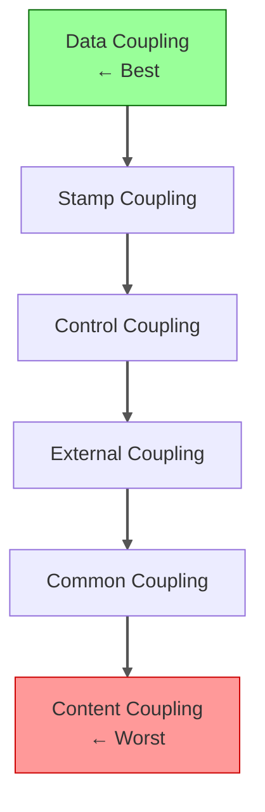
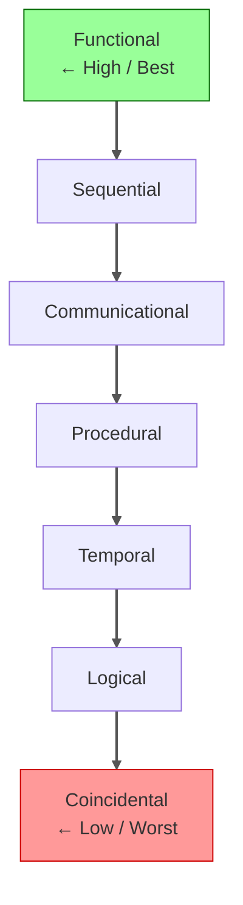

# Low coupling & high cohesion

## Low coupling

```mermaid
graph TD
    A[Data Coupling<br>← Best] --> B[Stamp Coupling]
    B --> C[Control Coupling]
    C --> D[External Coupling]
    D --> E[Common Coupling]
    E --> F[Content Coupling<br>← Worst]

    classDef best fill:#99ff99,stroke:#060
    classDef worst fill:#ff9999,stroke:#c00

    class A best
    class F worst

    linkStyle default stroke:#555,stroke-width:2.2px
```

## High cohesion

```mermaid
graph TD
    Functional[Functional<br>← High / Best] --> Sequential[Sequential]
    Sequential --> Communicational[Communicational]
    Communicational --> Procedural[Procedural]
    Procedural --> Temporal[Temporal]
    Temporal --> Logical[Logical]
    Logical --> Coincidental[Coincidental<br>← Low / Worst]

    classDef high fill:#99ff99,stroke:#060
    classDef low fill:#ff9999,stroke:#c00

    class Functional high
    class Coincidental low

    linkStyle default stroke:#555,stroke-width:2.2px
```
